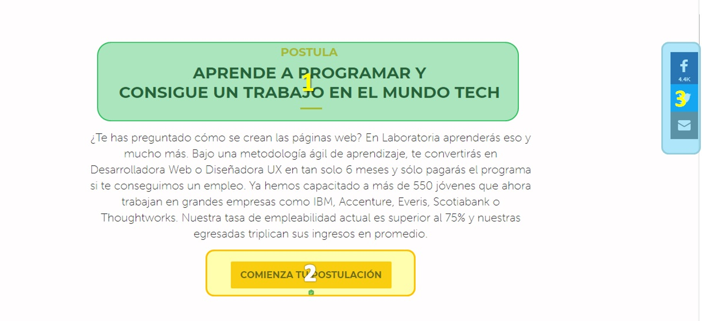
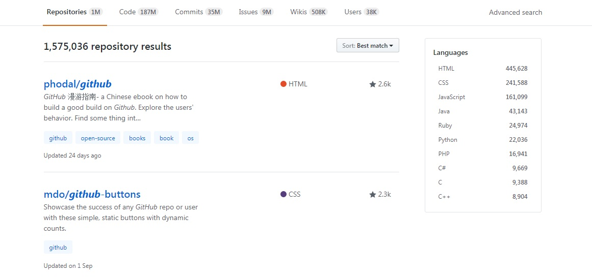

# LABORATORIA

Explica qué partes conforman el UX y qué partes el UI.

### Seccion 1 (pagina Laboratoria)

Se analiza las partes que conforma la primera seccion de la pagina de Laboratoria.

En esta imagen se analiza:
- Elementos UX:
    1. Los numeros **1** representan elementos *Care*.-
       El usuario al dar click en los botones, proporciona informacion adicional, si selecciona *Estudiante* se le dara informacion como:
         - Pasos para postular(esta debe ser simple y precisa).
         - Requisitos (informacion de edad minima o maxima, conocimentos previos, etc).
         - Informacion del Programa (duración, costo, etc).
         - Calendario (se menciona proximas convocatorias).
         - Formulario para postulacion (se solicita datos del usuario para comenzar su postulacion).
         - Preguntas frecuentes (se proporcina informacion de posibles dudas que el usuario pueda tener).
         ***

         

         En esta imagen se observa informacion importante para las nuevas postulantes. En ella se puede manejar como elementos **See** y/o **Think**, ya que de acuerdo a la sensacion y sentientos en ese momento de los usuarios, podra leer la informacion que proporciona Laboratoria, con la finalidad de que la proxima postulante y/o usuario tome una mejor decisión que pueda cambiar su vida.

         - Elementos UI:
           - Un `logo`(Laboratoria).
           - 2 `h3` subtitulo (color *#1c1c1b*), en el primer subtitulo agregar una lista *desordenada*. El segundo parrafos de informacion, incluyendo una lista *ordenada*.
           - Fondo de la seccion **blanco**.
           - El icono de chat del lado inferior izquierdo(color:*#f5f35d*).

         ***

         

         En la imagen se puede observar que Laboratoria proporciona un Formulario para que el usuario puede realizar su postulacion. Aqui se le invita a proporcionar datos (nombre, apellido, email, telefono, nivel de estudios, etc), con la finalidad de tener un control del proceso de seleccion.

         ***

         

         En la imagen se muestra una serie de preguntas para que la proxima postulante y/o usuario pueda aclarar algunas dudas, relacionado al proceso de seleccion y  poder tomar una mejor decisión.

         > Nota: En cada imagen se muestra un bloque de color **Azul** este representa un Chat (elemento fijo dentro del browser), esto con la finalidad de que el usuario puede ponerse en Contacto con Laboratoria.

       Si selecciona *Empresas* se ofrece dos Servicios como:

        

         - LABORATORIA FOR BUSINESS.- Proporcina a las empresas Servicios y/o Cursos para el personal que elaboren dentro de ella, esto con la finalidad de desarrollar sus habilidades y en estar a la vanguardia de la tecnologia.
         - CONTRATA TALENTO.- La empresas podran encontra talento para formar parte de su equipo digital.

         ***

        

        Aqui tanto las empresas como los usuarios pueden observar que Compañias y/o Empresas confian en Laboratoria.

    2. Los numeros **2** representan elementos *See*, estos elementos transmiten al usuario un impacto visual sobre lo que Laboratoria representa en la mujeres ingresan en el Bootcamp.
    3. El numero **3** representan elemento *Think*, se transmite (Sentimientos) Pensar, Sentir, Curiosidad y atencion, de que al tomar el Curso puede transformar su vida para un bienestar tanto personal como profesional.
    4. El numero **4** representan elemento *Do*, esta barra puede ayuda a los usuarios a comunicarse o ponerse en contacto a través de redes sociales como: Facebook, Twitter y/o correo electronico.

- Elementos UI:
Al analizar la **Primera Imagen del Documento** podemos observar elemento de **UI** tales como:
  - Una etiqueta `h1`(titulo).
  - 2 `button` (estudiantes y empresas) ambos de color *#c4c810* con letras *blancas*.
  - Una imagen de seccion.
  - Una caja de texto (contener un subtitulo `h3` y debe estar enfrente de la imagen).
  - Una Barra Lateral (esta barra es fija, cuando el usuario realiza un scroll se mantiene en su posición) debe incluir *3 iconos "Facebook, Twitter y correo electronico"*.

### Seccion 2 (pagina Laboratoria)

Se analiza las partes que conforma la segunda seccion de la pagina de Laboratoria.

En esta imagen se analiza:
- Elementos UX:
  1. El numero **1** representan elemento *Think*, transmite la sensacion de iniciar y adentrarse en el mundo de la tecnologia y programación. Tambien se da una breve informacion del Bootcamp proporcionando numeros reales de lo que Laboratoria realizo en estas generaciones de preparacion.
  2. El numero **2** representan elemento *Care*, el usuario podra comenzar su postulacion al dar click en el boton.
  3. El numero **3** representan elemento *Do*, esta barra puede ayuda a los usuarios a comunicarse o ponerse en contacto a través de redes sociales como: Facebook, Twitter y/o correo electronico.

- Elementos UI:
  - Una etiqueta `h2 o h3`(subtitulo).
  - Una caja de texto (Informacion de Bootcamp).
  - Un `button` (comienza tu postulación), color *#c4c810* con letras *blancas*.
  - Fondo *Blanco* en la seccion.
  - Una Barra Lateral (esta barra es fija, cuando el usuario realiza un scroll se mantiene en su posición) debe incluir *3 iconos "Facebook, Twitter y correo electronico"*.

### Seccion 3 (pagina Laboratoria)

Se analiza las partes que conforma la segunda seccion de la pagina de Laboratoria.

En esta imagen se analiza:
- Elementos UX:
  1. El numero **1** representan elemento *See*, este elemento transmiten al usuario, felicidad, satisfaccion, superacion de una egresada de Laboratoria, invitando a ser parte del Bootcamp para un gran cambio en su vida.
  2. El numero **1** representan elemento *Think*, la egresada expresa con palabras el cambio en su vida, donde comparte los logros obtenidos.
  3. El numero **3** representan elemento *Do*, esta barra puede ayuda a los usuarios a comunicarse o ponerse en contacto a través de redes sociales como: Facebook, Twitter y/o correo electronico.

- Elementos UI:
  - Una imagen de seccion (foto de egresada).
  - Una caja de texto (informacion de la egresada).
  - Una Barra Lateral (esta barra es fija, cuando el usuario realiza un scroll se mantiene en su posición) debe incluir *3 iconos "Facebook, Twitter y correo electronico"*.

### Seccion 4 (pagina Laboratoria)

Se analiza las partes que conforma la segunda seccion de la pagina de Laboratoria.

En esta imagen se analiza:
- Elementos UX:
  1. El numero **1** representan elemento *Think*, invita a las empresas en enfocarse al talento de las egresadas de Laboratoria. Explicando parte del curso como, duracion, formacion, habilidades y tasa de satisfaccion de los empleadores.
  2. El numero **2** representan elemento *Care*, la empresa y/o usuario al momento de dar un click podra ver y/o conocer el talento que Laboratoria preparo a lo largo del curso. Presentando estadisticas, graduadas, perfiles y porcentaje de contratacion.
  3. El numero **3** representan elemento *Do*, esta barra puede ayuda a los usuarios a comunicarse o ponerse en contacto a través de redes sociales como: Facebook, Twitter y/o correo electronico.

- Elementos UI:
  - Una etiqueta `h2 o h3`(subtitulo).
  - Una caja de texto (Informacion de Bootcamp).
  - Un `button` (conoce nuestro talento), color *#c4c810* con letras *blancas*.
  - Fondo *Blanco* en la seccion.
  - Una Barra Lateral (esta barra es fija, cuando el usuario realiza un scroll se mantiene en su posición) debe incluir *3 iconos "Facebook, Twitter y correo electronico"*.

### Seccion 5 (pagina Laboratoria)

Se analiza las partes que conforma la segunda seccion de la pagina de Laboratoria.

En esta imagen se analiza:
- Elementos UX:
  1. El numero **1** representan elemento *See*, este elemento transmiten al usuario, la satisfaccion de un jefe contento por la contratacion de egresadas de Laboratoria.
  2. Los numeros **2** representan elementos *Think*, el primero en palabras de un CEO expresa su sentir de contratar a egresadas de Laboratoria. El segundo ofrece a las empresas cursos para desarrollo de habilidades del equipo que la integran, ofreciendo un crecimiento y transformacion en la era digital.
  3. El numero **3** representan elemento *Care*, la empresa y/o usuario al momento de dar un click podra ver los cursos que se ofrecen e imparten.
  4. El numero **4** representan elemento *Do*, esta barra puede ayuda a los usuarios a comunicarse o ponerse en contacto a través de redes sociales como: Facebook, Twitter y/o correo electronico.

- Elementos UI:
  - Una imagen de CEO.
  - Una caja de texto (Informacion de CEO).
  - Una etiqueta `h2 o h3`(subtitulo).
  - Una caja de texto (Informacion de cursos y porcentaje de empresas que lo han solicitado).
  - Un `button` (conoce nuestros cursos), color *#c4c810* con letras *blancas*.
  - Fondo *Blanco* en la seccion.
  - Una Barra Lateral (esta barra es fija, cuando el usuario realiza un scroll se mantiene en su posición) debe incluir *3 iconos "Facebook, Twitter y correo electronico"*.

### Seccion 6 (pagina Laboratoria)

Se analiza las partes que conforma la segunda seccion de la pagina de Laboratoria.

En esta imagen se analiza:
- Elementos UX:
  1. Los numeros **1** representan elemento *See*, este elemento transmiten al usuario, la satisfaccion de un jefe satisfecho con su equipo de trabajo el segundo muestras cifras y porcentajes de graduadas, colocacion laboral.
  2. Los numeros **2** representan elementos *Think*, el primero en palabras de un gerente donde expresa el sentimiento sobre su equipo de trabajo. El segundo menciona el impacto que ha tenido Laboratoria en cifras.
  3. El numero **3** representan elemento *Do*, esta barra puede ayuda a los usuarios a comunicarse o ponerse en contacto a través de redes sociales como: Facebook, Twitter y/o correo electronico.

- Elementos UI:
  - Una imagen de gerente(parte de la seccion).
  - Una caja de texto (Informacion de gerente).
  - Una etiqueta `h2 o h3`(subtitulo).
  - Cuatro cajas de texto (se representa en cifras el impacto de Laboratoria).
  - Fondo Blanco en el resto de seccion.
  - Una Barra Lateral (esta barra es fija, cuando el usuario realiza un scroll se mantiene en su posición) debe incluir *3 iconos "Facebook, Twitter y correo electronico"*.

### Seccion 7 (pagina Laboratoria)

Se analiza las partes que conforma la segunda seccion de la pagina de Laboratoria.

En esta imagen se analiza:
- Elementos UX:
  1. Los numeros **1** representan elemento *See*, a grandes lideres del mundo (politica, social y tecnologia), en ella se expresa la satisfaccion, agrado y reconocimiento que se tiene al programa de Laboratoria. El segundo Bloque representa los logos de grandes Empresas aliados con Laboratoria.
  2. Los numeros **2** representan elementos *Think*, el primero en palabras del expresidente de USA **BARACK OBAMA** expresa la importancia de Laboratoria y la tasa de exito que esta impacta en el mundo. El segundo menciona las empresas aliadas.
  3. El numero **3** representan elemento *Do*, esta barra puede ayuda a los usuarios a comunicarse o ponerse en contacto a través de redes sociales como: Facebook, Twitter y/o correo electronico.

- Elementos UI:
  - Una imagen de grandes lideres del mundo(parte de la seccion).
  - Una caja de texto (Informacion del Expresidente de USA).
  - Una etiqueta `h2 o h3`(subtitulo).
  - Un bloque con 6 `logos` de empresas aliadas.
  - Fondo Blanco en el resto de seccion.
  - Una Barra Lateral (esta barra es fija, cuando el usuario realiza un scroll se mantiene en su posición) debe incluir *3 iconos "Facebook, Twitter y correo electronico"*.

### Seccion 8 (pagina Laboratoria)

Se analiza las partes que conforma la segunda seccion de la pagina de Laboratoria.

En esta imagen se analiza:
- Elementos UX:
  1. Los numeros **1** representan elemento *See*, Se muestran dos bloques que contienen los logos de empresas, la primera de reconocimientos y la segunda de presencia en los medios.
  2. Los numeros **2** representan elementos *Think*, se ofrece subtitulos que pueden ser de gran importancia para el usuario y/o empresa.
  3. El numero **3** representan elemento *Do*, esta barra puede ayuda a los usuarios a comunicarse o ponerse en contacto a través de redes sociales como: Facebook, Twitter y/o correo electronico.

- Elementos UI:
  - Fondo Balnco en la seccion
  - Una etiqueta `h2 o h3`(subtitulo).
  - Un bloque con logos de empresas (reconocimiento).
  - Una etiqueta `h2 o h3`(subtitulo).
  - Un bloque con logos de empresas (presencia en medios).
  - Una Barra Lateral (esta barra es fija, cuando el usuario realiza un scroll se mantiene en su posición) debe incluir *3 iconos "Facebook, Twitter y correo electronico"*.

### Seccion 9 (pagina Laboratoria)

Se analiza las partes que conforma la segunda seccion de la pagina de Laboratoria.

En esta imagen se analiza:
- Elementos UX:
  1. Los numeros **1** representan elemento *See*, el primer bloque muesta una tabla con tres articulos relacionados con Laboratoria, dos de ellos en ingles y uno en español.
  2. El numero **2** representan elemento *Care*, el usuario podra al dar click al primer elemento, este lo redireccionara al blog de Laboratoria, el segundo muestra un listado con 3 opciones: contactanos, trabaja con nosotros y blog.
  3. El numero **3** representan elemento *Think*, aqui se expresa el sentir de lo que es Laboratoria a nivel America Latina.
  4. El numero **4** representan elemento *Do*, esta barra puede ayuda a los usuarios a comunicarse o ponerse en contacto a través de redes sociales como: Facebook, Twitter y/o correo electronico.

- Elementos UI:
  - Fondo Balnco en la seccion.
  - Una etiqueta `h2 o h3`(subtitulo).
  - Icono de Blog.
  - Una seccion con tres columnas donde se muestre tres articulos, cada una de ellos incluye una etiqueta de titulo `h6`, una iamgen una caja de texto, y una etiqueta `a`.
  - Un etiqueta `p` dentro una etiqueta `a`.
  - Una Barra Lateral (esta barra es fija, cuando el usuario realiza un scroll se mantiene en su posición) debe incluir *3 iconos "Facebook, Twitter y correo electronico"*.
  - Un footer (pie de pagina o barra institucional)
    - Fondo negro.
    - Logo de Laboratoria (lado inferior izquierdo).
    - Una caja de texto.
    - Una lista con 3 opciones.

***
***

# GITHUB

Identificar los elementos de navegación de la pagina de GitHub.

En esta seccion el usurio, cuenta con una barra de menú, en ella se encuentra las siguientes opciones:
1. Caracteristicas.- en esta opcion se muestra una serie de servicios como:
  - Revision de codigo
  - Gestion de Proyectos
  - Integracion
  - Gestion de equipos
  - Documentacion
  - Alojamiento de codigo
  *El usuario al hacer click en algunas de estas opciones automaticamente lo lleva a la seccion correspondiente para mayor informacion.*
2. Negocio.- se menciona la importacia del servicio de GitHub para pequeñas y grandes empresas.
Se menciona algunas opciones como:
  - GitHub para hacer negocios
  - Clientes
  - Seguridad
  - Contacto para ventas.
  - Planes
  - Registro
  - Prueba gratis del producto
3. Explorar.- muestra informacion adicional de GitHub.
  - Blog
  - Colecciones
  - Tendencias
  - Recursos
  - Guias
  - Eventos
  - Temas
  - Impacto social
4. Mercado.- herramientas para construir y mejorar su flujo de trabajo.
  - Aplicaciones gratuitas
  - Añadido recientemente
  - Calidad de codigo
    - Codecov
    - codebeat
    - Better code Hub
    - Overoles
    - Codacy
    - StyleCI
    - Codigo clima
    - SideCI
  - Integración continua
    - Travis CI
    - AppVeyor
    - compañero
    - Cloud 66 Skycap
    - Circle CI
    - Percy
    - Semaforo
  - Supervisión
  - Gestión de proyectos
    - Codetree
    - Zube
    - Gofre
    - ZenHub
  - Lista de aplicación en el mercado.
5. Precios.- planes para todos los flujos de trabajo. Comparacion de productos como:
  - Desarrollador
  - Equipo
  - Negocios en GitHub.com
  - GitHub Enterprise
6. Search.- se realiza busqueda de cualquier tipo de tema o informacion acerca de GitHub (el usuario ingrese).

Cuando el usuario introduce unn texto a buscar GitHub muestra una lista de opciones relacionadas al tema, en ella se puede observar.
  - Repositorios
  - Code
  - Commits
  - Issues
  - Wikis
  - Users
De igual forma muestra una lista de los lenguajes de programacion como son:
  - HTML
  - CSS
  - Javascript
  - Java
  - Ruby
  - Python
  - PHP
  - C#
  - C
  - C++

7. Inicio de sesión.- cuando un usuario ya realizo el regitro correspondiente para tener una cuenta (gratuita o de paga).

En esta parte se debe ingresar Usuario y Contraseña. Una vez ingresando correctamente los datos, estara dentro de su sesion (perfil).

***

En esta seccion tendra una serie de opciones donde podra realizar las siguientes actividades y/o cambios:
  - Editar perfil
    - Profile
    - Account
    - Email
    - Notification
    - Biling
    - SSH and GPG Keys
    - Security
    - Blocked Users
    - Repositories
    - Organizations
    - Saved replies
    - Applications
  - Overview.- se muestra los repositorios en conjunto.
  - Repositories.- se muestra la lista de todos los repositorios creados por el usuario. Al ingresar algunos de nuestros repositorios la informacion se muestra como la siguiente imagen.

  - Clone or download.- descargar archivo ZIP del proyecto.
  - Fork.- cantidad de bifurcaciones (fork) del proyecto.
  - Inssues (Conflictos).
  - Pull Request (propuestas de cambios).
  - Watch.- cantidad de usuarios observando.
  - Commits (Revisiones efectuadas).
  - Archivos del proyecto, los que se pueden explorar manualmente estos son:
    - index.html
    - README.md
    - docs
    - js (archivo app.js)
    - css (archivo style.css o main.css)
    - assets (images, icon y  fonts)

  - Stars.- una forma de validar la calidad y utilidad de un proyecto.
  - Followers.- al seguir un desarrollador, le otorgas validez y recibes notificaciones de su actividad.

- En caso de olvidar contraseña se pedira al usurio un correo electronico para la recuperacion de esta.
- Si el usuario no cuenta con una cuenta debera registrarse.

8. Registrarse.- cuando un usuario no tiene cuenta en GitHub, debera ingresar ciertos datos para crear una cuenta (gratuita o de paga).

Si el usuario no cuenta con una cuenta debera registrarse. Se le solicitara la siguiente informacion:
- UserName
- Email
- Password

### Seccion 2 (pagina GitHub)
Se presenta la colaboracion en un proyecto, administracion de proyecto y herramientas.

Se manejan tres opciones las cuales son:
1. Escribir mejor codigo.- herramientas de revisión de código. Muestra una guia de los problemas o manejo de GitHub.
  - Hacer un cambio
    - Aprender los fundamentos de solicitud de extracción
  - Ver todas las actualizaciones
    - Difiere
    - Historia
    - Culpa
  - Resuelva conflictos simples
    - En GitHub
    - Usando la línea de comando
  - Fusionar el código de mayor calidad
    - Permisos
    - Ramas protegidas
    - Comprobaciones de estado requeridas
  - A prueba de balas su proceso de revisión
    - Codecov
    - Overoles
    - Codacy
    - CodeFactor
2. Gestión de proyectos simplificado.- los gerentes y desarrolladores de proyectos coordinan, rastrean y actualizan su trabajo en un solo luga
  - Comience con un problema
    - Aprenda los problema basicos de los problemas
    - Tareas
    - Asignatarios y menciones
    - Etiquetas
    - Hitos
  - Gestión personalizada de proyectos
    - Codetree
    - Zube
    - Gofre
    - ZenHub
3. Encuentra las herramientas necesarias.- Ajuste su proceso a medida que su equipo cambia, actualice las herramientas a medida que cambian las tecnologías y encuentre nuevas formas de trabajar mejor.
  - Descubre nuevas herramientas
    - Navega por el Mercado
    - Comience con las aplicaciones de GitHub
    - Envia tu aplicacion para revisión
  - Listo para registrarse
    - Desarrollador
    - Equipo
    - Negocios en GitHub.com
    - GitHub Enterprise

### Seccion 3 (pagina GitHub)
Se presenta la colaboracion en un proyecto, administracion de proyecto y herramientas.

Se manejar dos opciones las cuales son:
1. Aprenda sobre Integraciones.- Ajuste su proceso a medida que su equipo cambia, actualice las herramientas a medida que cambian las tecnologías y encuentre nuevas formas de trabajar mejor.
  - Descubre nuevas herramientas
    - Navega por el Mercado
    - Comience con las aplicaciones de GitHub
    - Envia tu aplicacion para revisión
  - Listo para registrarse
    - Desarrollador
    - Equipo
    - Negocios en GitHub.com
    - GitHub Enterprise
2. Examinar el mercado de GitHub.- Herramientas para construir y mejorar su flujo de trabajo.
  - Aplicaciones con pruebas gratuitas.- nuevas formas de construir mejor, ahora con una prueba gratuita de 14 días.
    - Travis CI
    - Gofre
    - Zube
    - POEditor
    - ZenHub
    - Codecov
    - Dependabot
    - Better Code Hub
  - Recientemente añadido
    - SideCI
    - issue.sh
    - Clip de la pagina
    - BackHub
    - Cloud 66 Skycap
    - Cloud 66 para rieles
    - TestQuality
  - Calidad del código
    - Codecov
    - codebeat
    - Better code Hub
    - Overoles
    - Codacy
    - StyleCI
    - Codigo clima
    - SideCI
  - Integración continua
    - Travis CI
    - AppVeyor
    - compañero
    - Cloud 66 Skycap
    - Circle CI
    - Percy
    - Semaforo
  - Gestión personalizada de proyectos
    - Codetree
    - Zube
    - Gofre
    - ZenHub

### Seccion 4 (GitHub)
Se presenta informacion a desarrolladores, empresas y comunidad de codigo abierto.

Se manejar tres opciones las cuales son:
1. Comunidad de codigo abierto.- El software de código abierto es libre para que lo use y explore. Al igual informacion de personas y/o comunidad que manejan GitHub.
2. Desarrolladores.-  se presenta informacion de infinitas oportunidades para aprender, codificar y crear, al mismo tiempo se presenta la informacion para adquirir un plan (gratuito o de paga).
3. Empresas.- se presenta informacion para una pequeña empresa o una gran empresa.
  - GitHub para hacer negocios
  - Clientes
  - Seguridad
  - Contacto para ventas.
  - Planes
  - Registro
  - Prueba gratis del producto

### Seccion 5 (pagina GitHub)
En el pie de pagina o barra institucional, se muestra informacion a desarrolladores, empresas asi mismo hace mencion de la caracteristicas, recursos y plataforma de GitHub.

>Nota: Las opciones y/o informacion que se muestra en la imagen, se mancionan en las secciones 1, 2, 3 y 4 de GitHub de este documento.

***
***

# SKETCH DEL DASHBOARD LABORATORIA

Crea un sketch para la herramienta del dashboard de Laboratoria.

El dashboard es una herramienta utilizada por profesores, training managers, directores y gerentes de Laboratoria para ver rápidamente qué está pasando en el salón de clases de Laboratoria. En el dashboard, los usuarios mencionados pueden ver rápidamente estadísticas y datos en tiempo real como:

- Numero de alumnas inscritas
- Numero de alumnas que desertaron
- Numero y porcentaje de alumnas que pasan el criterio mínimo de evaluación
- Promedio de notas por sprint
- Promedio de notas HSE
- Promedio de notas técnicas

### Pagina Inicial

En esta imagen de muestra la primera pantalla para entrar al portal.

En esta pagina el usuario tendra que iniciar Sesion.

### Login

Una vez que el usuario presiono click en el boton ***Sing In***, aparecera la ventana de **Iniciar Sesion**.

En ella debera ingresar:
- Nombre de usuario.
- Contraseña.
> Nota: si el usuario no recuerda alguno de estos Dos datos podra recuperar su contraseña, dando click en la opcion de Olvidaste tus UserName o Password.

### Pantalla Principal (Portal)

El usuario una vez ingresando sus datos para iniciar sesion, podra acceder a la pantalla Principal del Portal.

Como se muestra en la imagen, esta proporciona al usuario un ambiente amigable y de facil uso, en ella podra realizar:
1. Editar perfil.
2.  Realizar busqueda por:
  - Generacion.- Podra realizar una busqueda seleccionando la generecion y/o pais.
  - Egresada.- Podra realizar la busqueda por nombre, generacion y/o pais.
  - Alumnas.- Podra realizar la busqueda por nombre, generacion, pais y/o evaluación.
  - Desercion.- Podra realizar la busqueda por nombre y/o generacion.

  

***

3. Evaluacion.- En esta opcion el usuario podra verificar los promedios de la alumanas y/o egresadas por medio de:
  - Sprint.
  - HSE.
  - Tecnicos.

  

De igual manera el usuario tiene la opcion de realizar una estadistica (graficas) de su busqueda, puede ser de una o varias alumnas y/o egresadas.

***

4. Estadisticas.- En esta opcion se le brinda al usuario las los porcentajes totales y/o parciales de las alumnas, egresadas y empleadas por empresas, asi mismo podra realizar graficas o estadistica de los ultimos años, meses o semanas.

